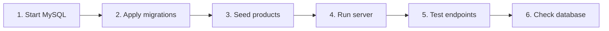

How to run the BrightBuy backend locally and test the cart endpoints end to end.
All commands are for **Windows PowerShell**, run from the `BrightBuy-backend` folder.

> The credentials below (`brightbuy_app` / `devapppass`) are for the **local dev database only**.
> Never use them against a real environment.

## Overview



## Prerequisites

| Requirement | Check |
|---|---|
| Docker Desktop installed and **running** | `docker --version` |
| Go installed | `go version` |
| Terminal opened in `BrightBuy-backend` | `cd "D:\DB project\BrightBuy-backend"` |

If `docker` is "not recognized": start Docker Desktop, wait for "Engine running", then **close and reopen** the terminal.

---

## 1. Start MySQL

```powershell
# Start only the MySQL container in the background (-d = detached).
docker compose up -d mysql

# Confirm it is running. Expect: STATUS "Up ... (healthy)", PORTS 0.0.0.0:3308->3306.
docker compose ps
```

---

## 2. Apply the migrations

Run in order. `Get-Content` reads the file and `|` sends it into the MySQL client inside the container (`-T` = no interactive terminal).

```powershell
# Catalog tables.
Get-Content db/migrations/0001_catalog_schema.up.sql | docker compose exec -T mysql mysql -ubrightbuy_app -pdevapppass brightbuy

# Stock function.
Get-Content db/migrations/0002_catalog_stock_function.up.sql | docker compose exec -T mysql mysql -ubrightbuy_app -pdevapppass brightbuy
```

### Temporary `customer` table (local testing only)

`cart` has a foreign key to `customer`, which the auth feature will create later. Until then, create a minimal one **in your local database**. This does not change any repo file, and must not be added to a migration.

```powershell
docker compose exec mysql mysql -ubrightbuy_app -pdevapppass brightbuy -e "CREATE TABLE customer (customer_id INT AUTO_INCREMENT PRIMARY KEY); INSERT INTO customer VALUES (1);"
```

Once the real auth migration exists, reset the local DB (see [Reset](#reset-the-local-database)) and run all migrations in order.

### Cart tables

```powershell
Get-Content db/migrations/0003_cart_schema.up.sql | docker compose exec -T mysql mysql -ubrightbuy_app -pdevapppass brightbuy

# Expect: cart and cart_item.
docker compose exec mysql mysql -ubrightbuy_app -pdevapppass brightbuy -e "SHOW TABLES LIKE 'cart%';"
```

If a migration fails halfway, the tables created before the error remain. Drop them and rerun:

```powershell
docker compose exec mysql mysql -ubrightbuy_app -pdevapppass brightbuy -e "DROP TABLE IF EXISTS cart_item; DROP TABLE IF EXISTS cart;"
```

---

## 3. Seed products

Load the catalog seed script from the repo (find it with `Get-ChildItem -Recurse -Filter *.sql`), then check the data:

```powershell
# Example path: adjust to where the seed script lives in the repo.
Get-Content db/seed/catalog.sql | docker compose exec -T mysql mysql -ubrightbuy_app -pdevapppass brightbuy

# Pick variants to test with.
docker compose exec mysql mysql -ubrightbuy_app -pdevapppass brightbuy -e "SELECT variant_id, price, stock_quantity, is_active FROM product_variant LIMIT 5;"
```

The tests below assume this seed data. If your values differ, adjust the IDs and quantities.

| Variant | Price | Stock | Used for |
|---|---|---|---|
| 1 | 799.99 | 12 | Add, add more, update, delete |
| 3 | 1599.99 | 0 | Out-of-stock rejection |
| 5 | 499.99 | 4 | Exceeds-stock rejection |

Prices are returned in **cents** (`79999` = 799.99).

---

## 4. Run the server

Use **two terminals**: Terminal 1 runs the server and stays busy, Terminal 2 runs the tests.

**Terminal 1:**

```powershell
cd "D:\DB project\BrightBuy-backend"

# Tell the app where MySQL is (3308 is the port Docker exposes).
# Only lasts for this window, so set it every time you open a new terminal.
$env:DB_DSN = "brightbuy_app:devapppass@tcp(127.0.0.1:3308)/brightbuy?parseTime=true"

# Note the "./" before cmd. Stop with Ctrl+C, and restart after every code change.
go run ./cmd/api
```

Wait for `msg="server starting" addr=:8080`.

**Terminal 2:**

```powershell
curl.exe http://localhost:8080/healthz   # expect: ok
curl.exe http://localhost:8080/readyz    # expect: ok (pings MySQL)
```

---

## 5. Test the endpoints

**Terminal 2.** Paste this setup once per terminal. The helper prints the status code **and** the server's error message, which plain `Invoke-RestMethod` hides.

```powershell
$base = "http://localhost:8080"
$h = @{ "Content-Type" = "application/json" }

function Call-Api($method, $path, $body) {
    try {
        Invoke-RestMethod -Method $method "$base$path" -Headers $h -Body $body
    } catch {
        $status = [int]$_.Exception.Response.StatusCode
        $msg = $_.ErrorDetails.Message
        if (-not $msg) {
            $stream = $_.Exception.Response.GetResponseStream()
            if ($stream.CanSeek) { $stream.Position = 0 }
            $msg = (New-Object System.IO.StreamReader($stream)).ReadToEnd()
        }
        Write-Host "HTTP $status : $msg"
    }
}
```

### Happy path

```powershell
# 0. Start clean.
Call-Api Delete "/cart/items/1?customer_id=1"

# 1. Read an empty cart. Expect: no items, Subtotal 0.
Call-Api Get "/cart?customer_id=1"

# 2. Add 2 of variant 1. Expect: Quantity 2, LineTotal 159998.
Call-Api Post "/cart/items?customer_id=1" '{"variant_id":1,"quantity":2}'

# 3. Add 3 MORE. Expect: Quantity 5 (adds to the existing quantity).
Call-Api Post "/cart/items?customer_id=1" '{"variant_id":1,"quantity":3}'

# 4. Set the quantity to exactly 1. PATCH replaces; the 1 in the URL is the variant ID.
Call-Api Patch "/cart/items/1?customer_id=1" '{"quantity":1}'

# 5. Read the cart. Expect: variant 1, Quantity 1.
Call-Api Get "/cart?customer_id=1"

# 6. Remove the item. Expect: empty cart.
Call-Api Delete "/cart/items/1?customer_id=1"
```

### Rejection cases

Each of these is **supposed to fail**.

```powershell
# Variant 5 has stock 4.
# Expect: HTTP 400 : requested quantity 10 exceeds available stock 4
Call-Api Post "/cart/items?customer_id=1" '{"variant_id":5,"quantity":10}'

# Variant 3 has stock 0.
# Expect: HTTP 400 : requested quantity 1 exceeds available stock 0
Call-Api Post "/cart/items?customer_id=1" '{"variant_id":3,"quantity":1}'

# Quantity 0 is invalid.
# Expect: HTTP 400 : variant_id must be positive and quantity must be at least 1
Call-Api Post "/cart/items?customer_id=1" '{"variant_id":1,"quantity":0}'

# Variant does not exist.
# Expect: HTTP 400 : variant not found
Call-Api Post "/cart/items?customer_id=1" '{"variant_id":9999,"quantity":1}'

# Updating an item that is not in the cart (cart was emptied above).
# Expect: HTTP 400 : cart item not found
Call-Api Patch "/cart/items/1?customer_id=1" '{"quantity":1}'

# Total over stock: add 5, then try to add 8 more (5 + 8 = 13 > stock 12).
# Expect: HTTP 400 : requested quantity 13 exceeds available stock 12
Call-Api Post "/cart/items?customer_id=1" '{"variant_id":1,"quantity":5}'
Call-Api Post "/cart/items?customer_id=1" '{"variant_id":1,"quantity":8}'

# Clean up.
Call-Api Delete "/cart/items/1?customer_id=1"
```

### Expected results

| Test | Expected |
|---|---|
| Empty cart | No items, subtotal 0 |
| Add 2 | Quantity 2 |
| Add 3 more | Quantity 5 |
| Patch to 1 | Quantity 1 |
| Delete | Empty cart |
| Over stock / out of stock | 400, "exceeds available stock" |
| Quantity 0 | 400, "quantity must be at least 1" |
| Unknown variant | 400, "variant not found" |
| Update missing item | 400, "cart item not found" |

> Error statuses are all 400 for now. Planned: 404 for not found, 409 for stock conflicts.

---

## 6. Check the database directly

Run while the cart has items (for example after step 2 or 3).

```powershell
docker compose exec mysql mysql -ubrightbuy_app -pdevapppass brightbuy -e "SELECT * FROM cart; SELECT * FROM cart_item;"
```

---

## 7. Go tests

```powershell
# Everything.
go test ./...

# Only the cart stock test, verbose.
go test ./internal/cart/app -run TestService_AddItem_RejectsOverStock -v
```

The test connects to the real database, so MySQL must be running with migrations and seed data applied. Use a variant that exists and has low stock (for example variant `5`, stock 4), not an invented ID.

---

## Reset the local database

```powershell
# Deletes ALL local data (container volumes). Then redo steps 1 to 3.
docker compose down -v
```

---

## Troubleshooting

| Symptom | Cause | Fix |
|---|---|---|
| `docker` not recognized | Docker not running, or terminal opened before install | Start Docker Desktop, reopen the terminal |
| `no required module provides package .cmd/api` | Typo | Use `./cmd/api` |
| `Unable to connect to the remote server` | Server not running | Start it in Terminal 1 |
| `config load failed` | `DB_DSN` not set in this window | Set `$env:DB_DSN` again |
| `database unreachable` on `/readyz` | MySQL down or wrong port | `docker compose ps`, check port 3308 |
| `404 page not found` on `/cart` | Routes not registered | Check cart wiring in `cmd/api/main.go` |
| `Table ... doesn't exist` | Migration skipped | Rerun the migrations in order |
| `ERROR 1064` syntax error in a migration | Trailing comma before `)` | Remove the comma after the last line in the table |
| `ERROR 1050 Table already exists` | A previous run partly applied | Drop the cart tables and rerun |
| `Access denied` | Wrong user, password or port | Use the DSN above |
| Add shows Quantity 3 instead of 5 | Old `AddItem`, or server not restarted | Update `service.go`, restart the server |
| `invalid JSON` using `curl.exe -d` | PowerShell quote mangling | Use `Call-Api` or `-d "@body.json"` |
| Error body is empty in PowerShell | Response body already consumed | Use the `Call-Api` helper above |
| `mysql: [Warning] Using a password on the command line` | Expected for the dev DB | Ignore |
