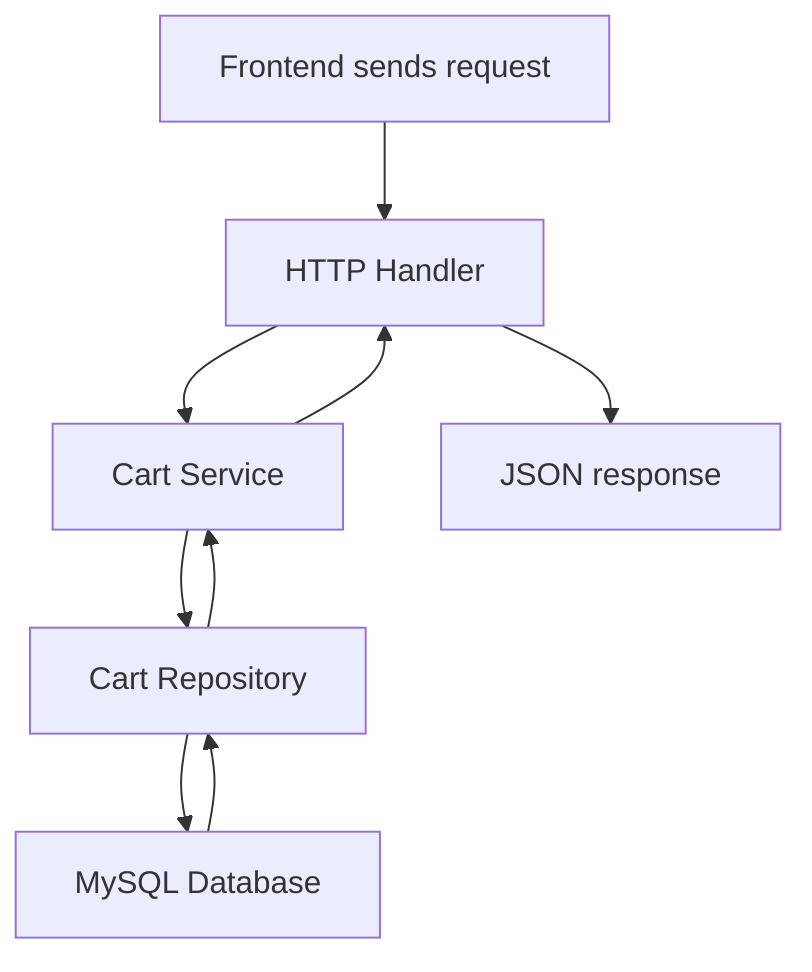

## Your cart backend, from scratch

What you built is the core backend for a shopping cart in a clean layered Go project.  
The big picture is:

- the frontend sends an HTTP request
- the backend receives it
- it validates the request
- it checks rules like quantity and stock
- it reads or writes MySQL
- it returns JSON to the client

That is the whole backend flow.

---

## 1) The project structure

You are working in a backend app with this pattern:

- `main.go`  
  starts the server and wires everything together

- `cart.go`  
  defines the cart data model

- `cart_repository.go`  
  contains SQL queries

- `service.go`  
  contains business rules

- `handler.go`  
  receives HTTP requests and returns responses

- `0003_cart_schema.up.sql`  
  creates cart tables in the database

---

## 2) What each layer does

### A. Database layer
This is MySQL. It stores real data.

The cart tables were created with the migration in `0003_cart_schema.up.sql`.

It includes:
- `cart`
- `cart_item`
- rules like:
  - one cart per customer
  - one variant per cart only once
  - quantity must be at least 1

This is important because it prevents bad data at the database level.

---

### B. Domain layer
This is the Go representation of the cart.

In `cart.go`, you defined:
- `Cart`
- `CartItem`
- `Money`

This is just the shape of the data in code.

Example:
- a cart belongs to a customer
- a cart has many items
- each item has a variant ID, quantity, subtotal, stock warning

---

### C. Repository layer
This is where SQL lives.

In `cart_repository.go`, you implemented methods like:
- `Get`
- `UpsertLine`
- `FindLine`
- `DeleteLine`

This layer does database work only.

Example:
- “get all items in customer cart”
- “insert or update item”
- “delete one item”
- “find a specific item”

This is the bridge between Go and MySQL.

---

### D. Service layer
This is business logic.

In `service.go`, you added validation such as:
- customer ID must be positive
- variant ID must be positive
- quantity must be at least 1
- item must exist before updating
- stock cannot be exceeded

This is where the app decides what is allowed.

---

### E. HTTP layer
This is the API boundary.

In `handler.go`, you created handlers for:
- `GET /cart`
- `POST /cart/items`
- `PATCH /cart/items/{variantID}`
- `DELETE /cart/items/{variantID}`

This layer:
- reads request JSON
- reads query params
- calls the service
- returns JSON

---

### F. Router / main entry
In `main.go`, the app:
- reads config
- opens DB connection
- builds chi router
- registers routes
- starts the HTTP server

This is the composition root: the place where everything is connected.

---

## 3) Full request flow



This is the exact lifecycle of a cart action.

Example:
- add item to cart
- request comes in
- handler parses JSON
- service validates
- repository inserts into table
- database stores it
- repository loads updated cart
- response is sent back

---

## 4) What you actually completed

You have already completed the core backend cart foundation:

- database schema
- cart data model
- repository SQL layer
- business validation
- HTTP endpoints

This means your project now has a real cart backend structure.

---

## 5) What is still missing for a complete real project

This is important, because you are still at the beginner stage and should know the difference between “working foundation” and “full feature complete.”

Still missing:
- customer/auth integration
- strict checkout flow
- product stock reservation
- more robust error handling
- tests with Dockerized MySQL
- frontend cart UI

A cart feature is not fully complete until it is connected with:
- auth
- products
- checkout
- order creation

---

## 6) Why this is a good first backend project

This project is a good beginner backend because it teaches the real pattern used in production:

- database first
- domain model
- repository
- service
- HTTP layer
- router wiring

You are learning the standard architecture, not just random functions.

That is exactly how real backend apps are built.

---

## 7) Verified status

I verified the backend compiles successfully with:

```bash
cd "d:\DB project\BrightBuy-backend"
go test ./...
```

This exited successfully with code 0.

The database-backed cart test, however, still requires a running MySQL database and migrations, which is why the integration-style cart test needs Docker/MySQL to be working in your environment.

---

## 8) Simple summary in one sentence

You built the cart backend foundation: database tables, Go cart models, SQL repository logic, business validation, and HTTP API endpoints — which is exactly the correct first backend project structure.

If you want, I can next give you:
1. a “cart backend roadmap” from beginner to advanced, or